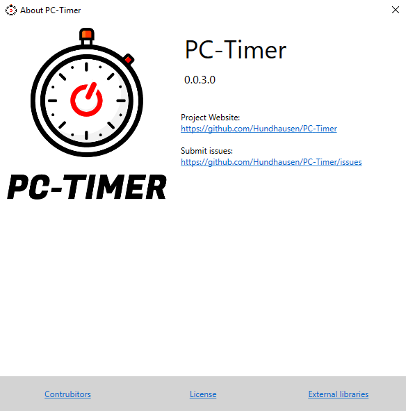

 

# PC-Timer
### With this Programm, you can set a Time when your PC should shutdown.

##### This Program needs the .NET Framework 4.5 (in the Setup)
---

## Screenshots

## Planned:
- progressbar and time when event is planned
- scrollable time for mouse only usage

## Comming in next release
- Better Info MessageBox with more infos (which other Projects are used and who helped)
- add a check routine so that the pc don't turn off directly when there time is too low

## Release History
- 0.0.2
  - better setup (has the .NET Framework integrated in the setup)
  - remembers the latest language setting
  - reduced the required framework a bit
- 0.0.1
  - first release

## External libraries
- [xceedsoftware](https://github.com/xceedsoftware) for the [Extended WPF Toolkit](https://github.com/xceedsoftware/wpftoolkit)

## Contrubitors
- [Hundhausen](https://github.com/Hundhausen) - Idea and initial work
- [Yasujizr](https://github.com/Yasujizr) - Logo Design

## Contributing or what you can do
1. Fork the project
2. Create a branch for your feature - **Important!**
3. Commit and push your changes
4. Add your Name to the project under Contrubitors or tell me in the Pull Request (your name will be in the readme file and on the about window, inside the program)
5. Create a Pull Request

You can do whatever you want. When you think that your feature will fit, make it. When it works and fits into the project, I will accept it. 
The Program supports multiple languages and you can add a language (please no Google Translate translations). In the Folder "PC-Timer/Resources/" are the files for the language. Please use the right CultureInfo Code (First position is the *Two Letter Language Code* and on the second position the *Two Letter Country Code*). Only adding this file, will not work and you must change a bit in the code. When you can't do it, than say this in the Pull Request and I can add it. 
It's important to add a new Branch, so that others or I can make changes, before merging it to the master branch.  
